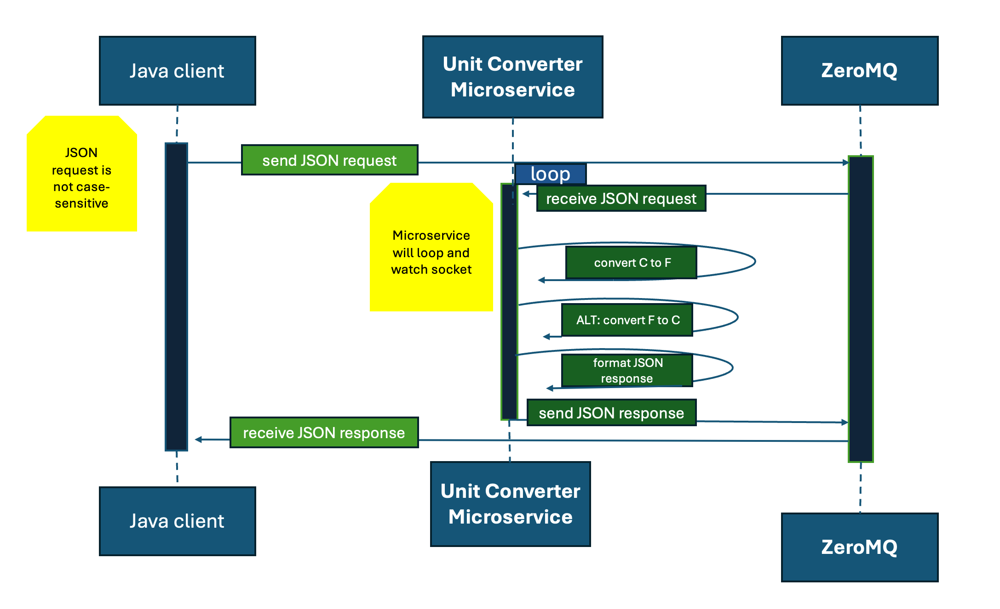

# Unit Converter Microservice

### Description of unit converter microservice: 
This microservice converts between C and F and F to C using ZeroMQ.

### Communication Contract: 
This microservice uses ZeroMQ request-reply pattern.


### How to programmatically REQUEST data?
To request the microservice to convert temperature units, a JSON string should be sent
to the bound address (5555). 

example call (python using pyzmq): 
```python
import zmq
import json

context = zmq.Context()
requester = context.socket(zmq.REQ)
requester.connect("tcp://localhost:5555")

request_data = {
  "from": "F",
  "to": "C",
  "resultScale": 2,
  "values": [68, 77, 99]
}

request_string = json.dumps(request_data)
print(f"Sending request: {request_string}")
requester.send_string(request_string)

#  You can receive the reply here and print it if wanted
#  reply_string = requester.recv_string()

requester.close()
context.term()
```

### How to pragmatically RECEIVE data
The unit converter microservice will respond with a JSON string (an example is shown below). The client will need to receive
the string and parse it as a JSON object (into a Python dictionary etc.). 
```
{
  "values": [ 45.54 , 10.55, 20.33 ]
}

```
example python code to receive and parse the JSON string response:
```Python
import zmq
import json

context = zmq.Context()
requester = context.socket(zmq.REQ)
requester.connect("tcp://localhost:5555")

# send request_data here in specified JSON format 

# response string
reply_string = requester.recv_string() 
print(f"received reply: {reply_string}")

# parse the JSON string here
response_json = json.loads(reply_string)

converted_values = response_json["values"]
print(f"successfully converted values: {converted_values}")

requester.close()
context.term()
```

### UML sequence diagram


